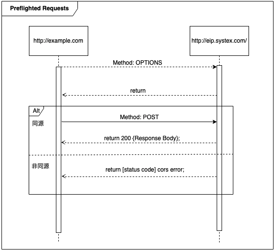

:source-highlighter: highlight.js
:highlightjs-theme: atom-one-dark-reasonable

= Group 1

== 1.型別
=== 原始型別/物件型別

.原始型別：
* Number
* String
* Boolean
* Undefined
* Null
* Symbol --ES6新增
* BigInt 

(可以使用 typeof 檢視型別)

=== 1.1. Number
包括整數和浮點數。

[source,javascript]
----
let integer = 42;
let float = 3.14159;
----
=== 1.2. String

[source,javascript]
----
let s = 'Hello';
let d = "World";
----
=== 1.3. Boolean
 `true` 和 `false`。用於條件語句和邏輯運算

[source,javascript]
----
let isTrue = true;
let isFalse = false;
let comparison = 5 > 3;  // true
----

=== 1.4. Undefined
表示變數已宣告未賦值,或是函數沒有返回值

[source,javascript]
----
let undefinedVar;
console.log(undefinedVar);  // undefined

function noReturn() {}
console.log(noReturn());    // undefined
----

=== 1.5. Null
表示"無"、"空"或"值未知"的特殊值

[source,javascript]
----
typeof undefined             // undefined
typeof null                  // object
----

=== 1.6. Symbol (ES6)
用於創建唯一的標識符號。主要用作對象屬性的鍵

[source,javascript]
----
let sym1 = Symbol('hello');
let sym2 = Symbol('hello');
console.log(sym1 === sym2);  // false
console.log(sym1);  //Symbol(hello)
console.log(sym2);  //Symbol(hello)
console.log(sym1.description);  // 輸出: "hello"
----

=== 1.7. BigInt 
用於表示大於 2^53 - 1 的整數

[source,javascript]
----
let bigInt = 1234567890123456789012345678901234567890n;
console.log(typeof bigInt);  // "bigint"
----

== 2. 物件型別 (Object Types)

物件型別是可變的且可以有方法。所有非原始型別的值都是物件

* Object
    ** Array
    ** Function
    ** Date
    ** RegExp

=== 2.1. Object
基本物件類型,其他所有非原始型別都繼承自 Object

[source,javascript]
----
let person = {
  name: "John",
  age: 30,
  greet: function() {
    console.log(`Hello, I'm ${this.name}`);
  }
};

console.log(person.name);  // "John"
person.greet();            // "Hello, I'm John"
----
=== 2.2. Array
索引從 0 開始

[source,javascript]
----
let fruits = ["apple", "banana", "orange"];
console.log(fruits[1]);  // "banana"
fruits.push("grape");    // 添加元素到[4]
fruits.pop();            // 移除最後一個元素
----

=== 2.3. Function
在 JavaScript 中,函數也是對象,可以有屬性和方法

[source,javascript]
----
function greet(name) {
  return `Hello, ${name}!`;
}

let sayHi = function(name) {
  console.log(`Hi, ${name}!`);
};

let arrowFunc = (x) => x * 2;

console.log(greet("Alice"));     // "Hello, Alice!"
sayHi("Bob");                    // "Hi, Bob!"
console.log(arrowFunc(5));       // 10
----

=== 2.4. Date
用於處理日期和時間

[source,javascript]
----
let now = new Date();
let specific = new Date('2023-01-01T00:00:00');
console.log(now.getFullYear()); //2024
console.log(now.getDate()); //30
----

=== 2.5. RegExp
正規表達式
[source,javascript]
----
let regex1 = /pattern/i;  // i 表示不區分大小寫
let regex2 = new RegExp('pattern', 'g');  // g 表示全局搜索

let text = "Find a PATTERN in this text";
console.log(regex1.test(text));  // true
console.log(text.match(regex2)); // ["PATTERN"]
----

== 3. 型別轉換和檢查

=== 顯性轉換/隱性轉換

.顯性轉換：
顯性轉換是通過特定函數明確進行的轉換。

* 強制轉型

1. Number(): 將值轉換為數字。
+
[source,javascript]
----
    let num1 = Number("42");     // 42
    let num2 = Number("Hello");  // NaN
----

2. String(): 將值轉換為字符串。
+
[source,javascript]
----
    let str1 = String(42);     // "42"
    let str2 = String(true);   // "true"
----

3. Boolean(): 將值轉換為布爾值。
+
[source,javascript]
----
    let bool1 = Boolean(1);     // true
    let bool2 = Boolean("");    // false
----
** 以下皆為false
+
[source,javascript]
----
    console.log(Boolean(0));
    console.log(Boolean(-0));
    console.log(Boolean(0n));
    console.log(Boolean(""));
    console.log(Boolean(NaN));
    console.log(Boolean(null));
    console.log(Boolean(undefined));
    console.log(Boolean(false));
----
4. Object(): 將值轉換為物件。
+
[source,javascript]
----
    let obj1 = Object(42);    // Number {42}
    let obj2 = Object("Hi");  // String {"Hi"}
----

* 方法轉型
** ParseInt()
** ToString()

.隱性轉換：
1. Number + String = String
+
[source,javascript]
----
    let str1 = "123";
    let num1 = 456;
    let result1 = str1 + num1;
    console.log(result1); // "123456"
    console.log(typeof(result1)); // String
----
2. Number + Boolean = Number
+
[source,javascript]
----
    let num2 = 1;
    let bool2 = true;  // true 被隱性轉換為 1
    let result2 = num2 + bool2;
    console.log(result2);      // 輸出: 2
    console.log(typeof(result2)); // Number
----
3. String + Boolean = String
+
[source,javascript]
----
    let str3 = "123";
    let bool3 = true;
    let result3 = str3 + bool3;
    console.log(result3);      // "123true"
    console.log(typeof(result3)); //String
----
4. Array + Object = String
+
[source,javascript]
----
    let str = [1,2,3];
    let car = {
        color: "red",
        price: 100
    };
    let result = str + car;
    console.log(result);      // 1,2,3[object Object]
    console.log(typeof(result)); //String
----

=== 型別比較

.Strict and loose equality (== vs ===)
* 這兩個最主要的差別，在於 === 會多比較型態的部份。

[source,javascript]
----
let str4 = "123";
        let num4 = 123;
        
        console.log(str4 == num4); // true
        console.log(str4 === num4); // false
----
* 比較+隱形轉換

[source,javascript]
----
    let num5 = 123;
    let str5 = "123";
    let result5 = num5 == str5;  // true，因為 "123" 被隱性轉換為 123
    console.log(result5);      // 輸出: true
    console.log(typeof(result5)); // boolean
----

== 2.函式
=== Immediately Invoked Function Expression, IIFE
==== 是一個定義完馬上就執行的函式。
[source,javascript]
----
    function my_func(){
        console.log("執行這裡");
    }
----
==== 如果希望這個函式宣告完之後，馬上執行，且也只希望執行一次，也就是 IIFE，按照以下兩個步驟：
==== 1. 用小括號包起來，表示避免函式的宣告。
==== 2. 緊接著再加上小括號，表示要執行該函式。
[source,javascript]
----
    (function my_func(){
        console.log("執行這裡");
    })();
    my_func(); // 這裡可以繼續呼叫嗎？不行的，因為不存在該函式。

----
=== 高階函式 Higher-Order Function
==== 當一個函式可以接受另一個函式作為參數，或者返回一個函式作為結果的函式
==== 或是高階函式指的是該函式本身能不能接收函式當作參數，或是回傳函式作為回傳值。

[source,javascript]
----
const print = (message) => {
    console.log(`這是print ${message}`)
}

const helloMessage = () => {
    return "Hello Message"
}
console.log(print(helloMessage()));
// 這是print Hello Message
----

[source,javascript]
----
// 參數是一個函式跟兩個參數
const fun = (fun1, a, b) => {
    return fun1(a, b);
}

const add = (x, y) => x + y;
const multiply = (x, y) => x * y;

console.log(fun(add, 5, 3));       // 輸出: 8
console.log(fun(multiply, 5, 3));  // 輸出: 15
----

[source,javascript]
----
const greet = (name) => {
    return `Hello, ${name}!`;
};

const print = (fun, input) => {
    console.log(fun(input));
};

console.log(greet('Alice'));
print(greet, "Alice");
----

=== 閉包 Closure
==== 閉包（Closure）是函式以及該函式被宣告時所在的作用域環境（lexical environment）的組合。

.語法作用域
[source,javascript]
----
    // 計數器
    let counter = 0;
        
    function add() {
        counter += 1;
        return counter;
    }

    add();
----
* 如果counter被竄改怎麼辦?

.閉包
[source,javascript]
----
    function add() {
        let counter = 0;

        function plus(){
            counter += 1;
            return counter;
        }
        return plus;
    }

    let a = add();
    a();
----
=== this
* Refers to an object instance
** The value of what it refers to does not depends on how it is defined not how it is invoked.
+
[source,JavaScript]
const obj = {
  value: 1,
  hello: function() {
    console.log(this.value)
  }
}
obj.hello() // 1
const hey = obj.hello
hey() // undefined

** That's why we can have same methoods but different object and will result in different behavior
+
[source,JavaScript]
function getThis() {
  return this;
}
const obj1 = { name: "obj1" };
const obj2 = { name: "obj2" };
obj1.getThis = getThis;
obj2.getThis = getThis;
console.log(obj1.getThis()); // { name: 'obj1', getThis: [Function: getThis] }
console.log(obj2.getThis()); // { name: 'obj2', getThis: [Function: getThis] }

* Therefore there really isn't a point to use this outside the object.
* If used without an object, it will refers to global scope, with default binding like below
    ** In case of node.js & web
    ** Under strict mode, both will refer to undefined
    ** Under non-strict mode, web will refers to window
    ** Under non-strict mode, node.js will refers to global

* Callback
    ** In Arrow function and callback, once again it is referring to where this is called.
+
[source,JavaScript]
var obj = {
	price : 20,
	sum : function (cb){
		cb(100);
	},
    getData : function (val){
        console.log(this,val);
    }
}
obj.sum(obj.getData);//Window

== 更改 this 的值
* Call, Apply, Bind
    ** call: Basically just like normal function call
    *** takes call(obj,args1,args2....)
    ** apply: like above, but the arguments are send in array
    *** usage: apply(obj, [args1,args2..])
+
[source,JavaScript]
'use strict';
function hello(a, b){
  console.log(this, a, b)
}
hello.call('yo', 1, 2) // yo 1 2
hello.apply('hihihi', [1, 2]) // hihihi 1 2

    ** bind: can be used to locked in the value of this
+
[source,JavaScript]
'use strict';
function hello() {
  console.log(this)
}
const myHello = hello.bind('my')
myHello.call('call') // my

* Finally a little quiz
+
[source, JavaScript]
const obj = {
  value: 1,
  hello: function() {
    console.log(this.value)
  },
  inner: {
    value: 2,
    hello: function() {
      console.log(this.value)
    }
  }
}
const obj2 = obj.inner
const hello = obj.inner.hello
obj.inner.hello()
obj2.hello()
hello()

= *Group2 JavaScript研究*

== *文法*

=== *具名函式/匿名函式*:

[width=75%, cols="1,2,2"]
|===
|特性|具名函式|匿名函式
|名稱|有名稱|沒有名稱
|提升|是，提升到當前作用域的頂部|否，不能在定義前使用
|遞歸|是，可以自我調用|否，無法自我調用
|使用場景|多次調用、遞歸、調試|一次性使用、回調、事件處理
|===

== 具名函式
* 可使用聲明函式提升作用域
** 因此在定義前被調用不會出現錯誤

[,javascript]
----
console.log(sayHello("Alice")); // 調用函式

function sayHello(name) {
  return "Hello, " + name + "!";
}

}
----

[,javascript]
----
function sayHello(name) {
  return "Hello, " + name + "!";
}

console.log(sayHello("Alice")); // 調用函式

----

* 也可以用一般的表達式

[,javascript]
----
const subtract = function subtractNumbers(a, b) {
  return a - b;
};

console.log(subtract(5, 2)); // 輸出：3

----
* 可自我調用(遞迴)

[,javascript]
----
function factorial(n) {
  if (n === 0) {
    return 1; // 當 n 是 0 時，直接返回 1
  } else {
    return n * factorial(n - 1); // 調用自己，但 n 減 1
  }
}

console.log(factorial(5)); // 這裡會輸出 120，也就是 5 * 4 * 3 * 2 * 1
----

== *匿名函式*

* 匿名函式是指沒有名字的函式，它通常用於特定的用途而不需要重複使用。

*一般表達式 

[,javascript]
----
// 定義匿名函式並賦值給變量 add
const add = function(a, b) {
  return a + b;
};

// 使用 add 變量調用匿名函式
console.log(add(2, 3)); // 輸出：5

----

*回調函數(用來告訴程序在某個操作完成後做什麼事情)

[,javascript]
----
// 使用 setTimeout 函式進行延遲操作
setTimeout(function() {
  console.log("1 秒後顯示");
}, 1000);

----

*即刻執行函數

[,javascript]
----
(function() {
  var privateVar = "這是私有變量";
  console.log(privateVar); // 輸出：這是私有變量
})();

// 外部無法訪問 privateVar
console.log(privateVar); // 錯誤：privateVar is not defined

----

== Automatic Semicolon Insertion, ASI:

=== 先了解JavaScript語法
 * 程式碼區塊

[,javascript]
----
const a = ["String1","String2"] //字串 
const b = a ${a[1]} a //字串

const c = ["a","b"] //陣列

const e = ()=>{} //function
const f = function (){} // function
function g (){} //function

const d = {a,b,g}; //json 物件

//存取json
d.a
d["b"]
d.g() //執行fucntion
d["g"]()//執行fucntion
----

== Automatic Semicolon Insertion, ASI 中譯"自動插入分號"
* 程式碼區塊未結束 不會ASI

[,Javascript]
----
const a = [ //不會ASI
  "String1",//不會ASI
  "String2" //不會ASI
]  //ASI

const b = `a ${a} //不會ASI
 a` //ASI
----

* 下一行為運算子開頭 不會ASI

[,Javascript]
----
var a = 1 //不會ASI
+1 //ASI
++ //不會ASI
a //ASI
----

* [yellow]#下行開頭為 [ 、 (#

[source,Javascript]
----
console.log('log')

(function(){
  console.log('IIFE')
}())
----

[source,Javascript]
----
console.log('log');

['array'].map(function(element){
  console.log(element)
})
----

== *非同步*

=== *同步/非同步差異*:

* Javascript 是一種「單執行緒 (Single-Thread)」的語言，意思就是一次只能做一件事情，如果安排了很多事情要給他做，他就會讓這些事情去排隊，再一件一件做，逐行執行。這就是所謂的同步，一次只做一件事情。非同步的概念則是不需要等到前一件事情做完才做下一件事情。
* 程式碼:同步的程式碼就是一行一行執行下去非常直觀，而非同步就跟同步相反， 非同步的程式碼不用等待自己執行完畢就可以先執行下一行程式碼。
* 情境劇:
** 中午到了，小明要準備出門買雞腿便當配珍奶，假如今天小明走的是同步路線的話會長這樣：
*** 小明到了便當店點了雞腿便當，等到雞腿便當拿到之後再到飲料店點珍奶。
** 如果是非同步路線會長這樣：
*** 小明到了便當店點了雞腿便當，在等待的過程中先到飲料店點珍奶，之後再看哪邊先做完就先去拿已經做完的餐點。

* Stack(堆疊)
*** Stack 中文翻譯為堆疊，是資料結構的一種，它就像是疊盤子一樣，特性為後進先出

* Queue(佇列)
*** Queue 中文翻譯為佇列，是資料結構的一種，它就像排隊一樣，特性為先進先出

* Web APIs
*** Web API 是瀏覽器提供的方法，它並不是 JavaScript運行環境的一部分，且運作於瀏覽器端，也就是說他們可以同時運行

* Event Loop
*** 一個達成一個不阻塞的機制，主要功能是，一旦Stack清空，Event Loop就會把Queue中的第一個項目放到Stack中，Stack就會執行該項目。

* 圖示

image::eventloop.png[Event Loop, align=center]

* 在javascript 中的同步與非同步範例:

[,Javascript]
----
//同步
console.log('a');

function tf(){
    console.log('b');
}

tf();

console.log('c');
----

[,Javascript]
----
//非同步
console.log('a');

setTimeout(function t1(){
    console.log('b');
},10000);
setTimeout(function t2(){
    console.log('d');
},10000;

console.log('c');
----

Demo
[#link]
* http://latentflip.com/loupe/?code=Y29uc29sZS5sb2coJ2EnKTsKCgpzZXRUaW1lb3V0KGZ1bmN0aW9uIHRmKCl7CiAgICBjb25zb2xlLmxvZygnYicpOwp9LDEwMDAwKTsKCmNvbnNvbGUubG9nKCdjJyk7

=== *XMLHttpRequest/fetch*
  - XMLHttpRequest(XHR)
    * 更為古老
    * 使用上較為困難(底層)
    * 使用Callback
    * 範例 

[,Javascript]
----
function reqListener () {
  console.log(this.responseText);
}
var oReq = new XMLHttpRequest();
oReq.addEventListener("load", reqListener);
oReq.open("GET", "http://www.example.org/example.txt");
oReq.send(); 
----

  - fetch
    * 版本較新
    * 更多方便的API
    * 回傳Promise
    * 範例

[,Javascript]
----
fetch("http://www.example.org/example.txt")
 .then(res=>res.text())
 .then(console.log)
----

=== *AJAX*
  - 方法重點-以非同步的方式進行網路請求，再以DOM更新至HTML。

=== *Promise*:

Promise 本身是用來改善 JavaScript 非同步的語法結構。
JavaScript 是屬於同步的程式語言，因此一次僅能做一件事情，但遇到非同步的事件時，就會將非同步的事件移動到程式碼的最後方，等到所有的原始碼運行完以後才會執行非同步的事件。

以下列的程式碼來說，在 console 中依序的會出現的順序為：

- 開始

- 程式碼結束

- 非同步事件 <- 最後執行

[,javascript]
----
console.log('開始');

setTimeout(() => {
  console.log('非同步事件');
}, 0);

console.log('程式碼結束');
----

[big]*建立Promise*

Promise 是一個構造函式，需要透過 new 關鍵字建立一個Promise。而 Promise 會接收一個函式作為參數，這個函式又稱為 executor，executor 會立即執行。

[,Javascript]
----
new Promise((resolve, reject) => {
  console.log("executor 立即執行"); // executor 立即執行
});
----

[,Javascript]
----
function requestData(url) {
  return new Promise((resolve, reject) => {
    setTimeout(() => {
      if (url === "explainthis.io") {
        resolve("hello welcome to explainthis");
      } else {
        reject("it is not explainthis");
      }
    }, 3000);
  });
}

// 1. 請求成功
requestData("explainthis.io").then((res) => {
  console.log(res); //hello welcome to explainthis
});

//2. 請求失敗
requestData("explainthis.com").catch((e) => console.log(e)); //it is not explainthis
----

[big]*狀態*

一個 Promise 一定會處於以下三種狀態的其中一種

- pending：初始狀態，執行了 executor，但還在等待中。
- fulfilled：表示操作完成，執行 resolve 函式。
- rejected：表示操作失敗，執行 reject 函式。

[big]*then 的使用*

[,Javascript]
----
function requestData(url) {
  return new Promise((resolve, reject) => {
    setTimeout(() => {
      if (url === "explainthis.io") {
        resolve("hello welcome to explainthis");
      } else {
        reject("it is not explainthis");
      }
    }, 0);
  });
}

requestData("explainthis.com").then(
  (res) => {
    console.log(res);
  },
  (reason) => {
    console.log(reason);
  }
);
----

[big]*錯誤處理*

- catch

[,Javascript]
----
fetch("https://explainthis.com/data")
  .then((response) => response.json())
  .then((data) => {
    console.log(data);
  })
  .catch((error) => {
    console.error(error);
  })
  .finally(() => {
    console.log("close loader");
  });
----

=== *async/await*:

在 JavaScript 中，async/await 是一種讓非同步操作更容易理解和管理的語法。它建立在 Promise 的基礎上，但提供了更簡潔、更直觀的方式來處理非同步操作。

=== *async語法*

使用 async 關鍵字聲明的函式為非同步函式，非同步函式會返回一個 Promise 物件，而非直接返回函式執行的結果。
下方普通函式 f1() 直接返回字串 "Hello! ExplainThis!"

[,Javascript]
----
// 普通函式
function f1() {
  return "Hello! ExplainThis!";
}

f1(); // 輸出: "Hello! ExplainThis!"
----

下方程式碼中， async function f2() {...} 定義了一個名為 f2 的非同步函式，該函式返回字串 "Hello! ExplainThis!"，並將其封裝在一個 Promise 物件中。

[,Javascript]
----
// 非同步函式
async function f2() {
  return "Hello! ExplainThis!";
}

f2(); // 輸出: Promise {<fulfilled>: 'Hello! ExplainThis!'}
----

這兩個程式碼寫法其實是相同的，因為使用 async 時，會自動將回傳值包裝在一個 Promise 物件當中。

由於 async 函式總是返回一個 Promise 物件，如果要獲取該 Promise 的解析值，可以使用 .then() 方法:

[,Javascript]
----
async function f2() {
  return "Hello! ExplainThis!";
}

f2().then((result) => {
  console.log(result); // "Hello! ExplainThis!"
});
----

=== *await語法*

await 是一個運算子，用於等待一個 Promise 完成或拒絕。它通常與 async 函式一起使用，因為只有在 async 函式內部或模組的頂層，才能使用 await。

當使用 await 時，程式會暫停執行該 async 函式，直到 await 等待的 Promise 完成並回傳結果後，才會繼續往下執行。

[,Javascript]
----
async function getData() {
  // await 等待 fetch 這個非同步函式返回一個 Promise 並解析它
  const res = await fetch("https://example.com/data");

  // await 等待上一步的 Promise 解析後，再解析它的 JSON 資料
  const data = await res.json();

  // 前面兩步都完成後，才會執行這一行並印出資料
  console.log(data);
}

getData();
----

=== *使用 await 要注意的幾點*

在非 async 函式中使用 await 會報 SyntaxError 的錯誤

[,Javascript]
----
function f() {
  let promise = Promise.resolve("Hello! ExplainThis!");
  let result = await promise;
}
----

=== *如何使用 async/await*

使用 async/await 可以將非同步程式碼寫成類似同步的形式，使其更易讀、且更易維護。以下是一個用 Promise 寫的 getData 函式:

[,Javascript]
----
function getData(url) {
  return new Promise((resolve， reject) => {
    fetch(url)
      .then((res) => res.json())
      .then((data) => resolve(data))
      .catch((error) => reject(error));
  });
}

getData("https://example.com/data")
  .then((data) => console.log(data))
  .catch((error) => console.error(error));
----

=== *使用 async/await 來重寫 getData 函式*

[,Javascript]
----
async function getData(url) {
  try {
    const res = await fetch(url);
    const data = await res.json();
    console.log(data);
  } catch (error) {
    console.error(error);
  }
}

getData("https://example.com/data");
----

=== *async/await 與 Promise 的差別*

async/await 和 Promise 都是用於處理非同步操作的方式，但它們有以下一些差異:

- 語法: async/await 提供了更簡潔、更直觀的語法，使得非同步程式碼更易讀和維護。Promise 則需要使用 then 和 catch 方法來處理結果和錯誤，語法上較為冗長。
- 錯誤處理: 在 async/await 中，可以直接使用 try...catch 來捕獲錯誤，而在 Promise 中需要使用 catch 方法。
- 程式碼流程: async/await 可以使非同步程式碼看起來更像同步程式碼，更容易閱讀和理解。Promise 的程式碼流程則較為不連貫。

* * *

== Object literal (物件實字)

 * 用大括號來建立物件的語法
 * 屬性用名值對(name-value pairs)表示

[source, javascript]

----
const person = {
    firstName: "John",
    lastName: "Doe",
    age: 30,
    isEmployed: true
};

----

=== ES6後，物件的擴展（object literal extension）
==== 物件屬性簡寫
 * 變數名稱和屬性名稱一樣
 * 物件的屬性名稱為變數的名稱，物件的屬性值為變數的值

[source, javascript]
----
let text = '我是誰';
let msg2 = { // 縮寫前
  text: text
};
let msg2 = { text }; // 縮寫後 
----
==== 物件函式的語法簡寫
 * 省略了冒號 : 和 function 關鍵字
 * 這樣簡寫的方法，預設的屬性名稱會是字串的型態，本的簡寫 fn( ){...} 等同於 'fn'( ){...}

[source, javascript]
----
// ES5
let obj1 = {
  fn: function() {
    return 'ES5';
  }
};
console.log(obj1.fn());//ES5
----

[source,javascript]
----
// ES6
let obj3 = {
  fn() {
    return 'ES6';
  }
};
console.log(obj3.fn());//ES6
----
==== 具運算性的屬性名稱
 * 使用中括號[ ] 將表達式作為屬性名稱

[source, javascript]
----
let obj = {
  ["na"+"me"]: 'kent'
}
console.log(obj.name); // kent
----

#撰寫程式碼的時候, 以團隊 code styling 為主, 儘量不寫縮寫過後的程式碼#

== Optional Chaining

 * 可選串連運算子
 * 在「要確認的屬性或函式」後方「加上或換上」「?.」
 * 避開TypeError Exception
 * 判斷當前（?. 左側）這個屬性或函式是否為 Nullish 值：也就是  undefined 或 null，有的話會往右繼續執行，否則就停止執行，並回傳undefined

[source, javascript]

----
const releasedYear = phone?.year;
//先確認 phone 屬性再取得 year 屬性值回傳
----
==== Nullish coalescing operator

 * 空值合併運算子
 * 在「要確認的屬性或函式」後方「加上或換上」「??」
 * 當左側的操作數為null或者undefined時，返回其右側操作數，否則返回左側操作數

[source,javascript]

----
const foo=null ?? 'default string';
console.log(foo);//"default string"

const baz=0 ?? 42;
console.log(baz);//0
----

== JavaScript Object vs JSON

 * JSON( JavaScript Object Notation )就是一組字串
 * JavaScript Object在使用{ }建立物件時，屬性名稱是可以有引號也可以沒有的，但在JSON格式中，屬性名稱一定要有雙引號
 * 物件中的值為function，是無法透過JSON傳遞的

 * 將物件轉成JSON格式 JSON.stringify();

image::JSON.stringify.jpg[]
 * 將JSON格式轉成物件 JSON.parse()

image::JSON.parse.jpg[]

== HTTP
.主要特點：
* 無狀態(stateless)：每個請求與其之前或之後的請求無關
* 可擴展(scalable)：通過標頭和方法可以擴展功能
* 安全性：HTTPS（HTTP Secure）提供了加密和身份驗證

==== stateless vs. stateful

[width=85%, cols="2,4,3"]
[options="header"]
[%autowidth]
|===
| |stateless |Stateful
|定義 |每次用戶端發請求，伺服器都視為全新的請求

=>依靠用戶端給予的資訊

|追蹤session或是transactions ，並根據該歷史記錄對相同的輸入做出不同的反應 

=>根據的先前的紀錄而改變執行結果

|優點
|減少資源消耗，特別是在處理大量短期請求時更具效率和可擴展性|記住用戶端的操作，提供個性化的用戶體驗
|缺點
|無法提供個人化體驗，需額外的機制（如 cookies 或 token）來保存和傳遞狀態信息。|耗費較多資源追蹤seeeion和transactions
|例子|HTTP | session
|===

** HTTP status Code不屬於狀態，是請求完成後的結果

== HTTP Headers/Payload

發請求和接收回應的重要組成部分

用一個信封比喻

* HTTP Headers=> 地址、寄件人、收件人...

* Payload => 信件內容

---

=== HTTP Header包含的內容
1.Authentication 驗證
驗證用戶端身分，以保護伺服器端安全

 WWW-Authenticate: Basic realm="Example"

2.Caching 快取
藉由重複使用先前取過的資源，減少網路傳輸量

request中使用的cache

 Cache-Control: no-store //不儲存任何快取資料

response中使用的cache

 Cache-Control: max-age=<秒數> //快取資料的有效時間
  
 
3.Conditionals 條件式
客戶端在特定條件下請求資源，節省頻寬
 
 If-Modified-Since: Wed, 21 Oct 2020 07:28:00 GMT //自2020/10/21開始資源未被修改則抓取本地站存的資源
 
4.Connection management 連線管理
客戶端與伺服器端的連線狀態
 
 Connection: keep-alive //與伺服器保持連線

5.Content negotiation
資源的表示方式

 Accept-Language: en-US //英文

6.Cookies
紀錄用戶訊息
  
  Cookie: VISITOR_INFO1_LIVE=-obHrhCAQzA; VISITOR_PRIVACY_METADATA=CgJUVxIEGgAgLQ%3D%3D; YSC=Wf57uX-mbBc

7.CORS

  HTTPS的安全機制，可以跨到不同網站取資源
 
=== HTTP Headers：

客戶端和服務器之間互動所附加的的訊息(如瀏覽器類型、 傳遞的資料類型etc..)

自定義的header訊息用『x-』開頭，大多數已經廢除。

* 例子: 

 x-content-type-options:　nosniff 
 
 //規定只能遵照context-type的格式解析資源，提高網頁安全性，避免MIME類型混淆
 

補充：

MIME：標示網路上各種文件類型的標準，如：

 * text/html：HTML 文件
 * text/plain：純文本文件
 * image/jpeg：JPEG 圖像
 * image/png：PNG 圖像
 * application/json：JSON 文件

MIME類型混淆:伺服器識別資源類型時，解析錯誤。

如將javascript標記為text/plain，誘導伺服器去解析其內容

=== HTTP Headr分類：

==== 1.Request Headers

客戶端發出請求時夾帶的訊息，如要訪問的伺服器名稱、可接受的編碼格式等

常見的Request headers訊息：

  * Host: 訪問的伺服器主機名稱
  
  Host: www.w3schools.com
 
  * User-Agent：客戶端應用程序的資訊
    
   User-Agent：PostmanRuntime/7.40.0

  * Accept-Encoding： 客戶端編碼格式

  　Accept-Encoding: gzip, deflate, br

  *  Request methods:HTTP 請求方式

  　Request methods:HTTP: GET /index.html

==== 2.Response Headers

伺服器回應的訊息。
  
常見的Response headers訊息：
  
  * Server: 伺服器端的server類型
  
   Server :ECS (hhp/9ABD)
  
  * Date: 回傳日期

   Date: Wed, 31 Jul 2024 02:12:13 GMT

  * Status Code: 回傳執行結果
   
   Status Code:200 OK

==== 3.Representation header

表示回傳內容的格式，放在response Header裡面

* Content-Type: 回傳資源的格式
 
 Content-Type: text/html

* Content-Encoding: 編碼

 Content-Encoding: gzip

* Content-Language： 語言

 Content-Language： en

==== Payload：

request和respon包含的數據內容。

Request Payload (Request body) : 客戶端傳送Request請求所攜帶的資源參數。

Response Payload (Response  body) : 伺服器端回傳Response所攜帶的資源參數。

==== Payload vs. form

[width=85%, cols="2,4,3"]
[options="header"]
[%autowidth]
|===
| |Payload |form
|資料格式 |支援多種格式 如: json、xml、URL編碼格式... |URL編碼格式、
多部分編碼格式
|Context-type 
| application/json .1+| application/x-www-form-urlencoded

 multipart/form-data

|資料格式|{
  "name": "John Doe",
  "age": 30
}| name=John+Doe&age=30
|===

  參考資料：https://blog.csdn.net/qq_43842093/article/details/125883101

== Request Method

.GET
* 查詢
* 會回傳結果，帶參數的查詢會加在URL上面

帶參數GET方法URL

 https://book.tpml.edu.tw/search?searchInput=javascript&searchField=FullText

.HEAD
* 查詢對象的header
* 不會回傳資料

.POST
* 增、改
* 較常用在新增資料
* 修改的項目會包在body裡面

.PUT
* 增、改	
* 常用在修改資料
* 整筆覆蓋
* 若修改對象不存在 => 新增一筆新的
* 修改的項目會包在body裡面

.PATCH
* 更新資料
* 只修改異動的部分部分

.DELETE
* 刪除資料

.CONNECT
* 建立連線
EX.代理伺服器連線

.OPTIONS
* 查詢對方可用支援那些HTTP 方法

.TRACE		
* 偵測HTTP請求其間是否有變化，中間路由若有錯誤可用此方法
* HTML表單內不適用

==== hTTP method 比較

 * SAFE：不會對伺服器進行任何修改

 * IDEMPOTENT：重新導向(重複發送相同的請求)結果完全相同

 * CACHEABLE:允許快取

此為規範，實務上並非完全遵照，有部分內容僅在特定條件下才成立

EX: GET請求的若重新發送的同時，伺服器上的資源有被更動過，則回傳的結果不一致

[width=75%, cols="1,1,1,1,2,6"]
[options="header"]
|===
|Verb |SAFE |IDEMPOTENT|Cacheable|動作|語意
|GET	|O	|O	|O	|讀取	|請求所需要的資源。
|HEAD	|O	|O	|O	|讀取	|與GET相同，但只傳Header不傳資料。
|POST	|X	|X	|O	|新增	|在請求中攜帶負載(payload)，並執行新增/修改。
|PUT	|X	|O	|X	|完整更新	|請求更新一筆資源的所有內容，必須是存在的資源，資源傳遞必須完整，否則為空。
|PATCH	|X	|X	|X	|部分更新	|請求更新一筆資源的部分內容，必須是存在的資源。
|DELETE	|X	|O	|x	|刪除	|請求移除資源。
|CONNECT	|X	|X	|x	|建立通訊	|向server端建立連線
|OPTIONS	|O	|O	|x	|查詢通訊方式	|告訴server允許的通訊方式
|TRACE	|O	|O	|x	|偵測	|偵測HTTP通訊請求方式。

|===
  參考資料：
  https://hackmd.io/@monkenWu/Sk9Q5VoV4/https%3A%2F%2Fhackmd.io%2F%40gen6UjQISdy0QDN62cYPYQ%2FH1yxwXyNN?type=book

==== HTTP Statue Code

回傳HTTP請求是否已成功

1.資訊性回覆( 100– 199)

2.成功回覆( 200– 299)

3.重定向訊息( 300– 399)

4.客戶端錯誤回應( 400– 499)

5.伺服器錯誤回應( 500– 599)
					
==== 200 OK

請求成功。

==== 301 Moved Permanently

永久的重導向
所請求的資源的 URL 已永久更改

==== 302 Found

暫時的重導向
所請求的資源的 URI 已暫時更改

==== 304 Not Modified

用戶重新導向頁面時不需重新發request

==== 400 bad request

用戶端錯誤的原因（例如 錯誤的請求語法、無效的請求訊息框架或欺騙性的請求路由），伺服器無法或不會處理該請求

==== 401 Unauthorized

伺服器無法驗證用戶端身分的時候回傳，並夾帶 "WWW-Authenticate"的，告訴用戶端必須提供身分驗證的訊息

==== 404 Not Found

伺服器找不到所請求的資源。在瀏覽器中，這表示該 URL 無法識別

==== 405 Method Not Allowed

伺服器已知請求方法，但目標資源不支援。例如不允許呼叫DELETE刪除資源

==== 500 Internal Server Error

伺服器遇到一個它不知道如何處理的情況。

==== 503 Service Unavailable

伺服器尚未準備好處理請求

常見原因是伺服器因維護而停機或過載

==== 504 Gateway Timeout

當伺服器，無法及時得到回應時，會出現此錯誤回應

=== HTTP port

常見的HTTP port

==== HTTP:80

未加密的 HTTP

==== HTTPS:443

加密的 HTTP，使用 SSL/TLS 協議來加密數據，確保數據在傳輸過程中的安全性。

==== SSH:22

用於在不安全的網絡上安全地訪問和管理遠程伺服器。它提供了加密通信，並常用於遠程登入系統和執行命令。

=== 什麼是跨域資源共享(Cross-Origin Resource Sharing) ?

Server 可以去和瀏覽器說, 允許除了自身以外, 及自身允許的來源網站所發送過來的 Request, 可以被正常的回傳 response。

瀏覽器的同源政策(Same-Origin-Policy), 是一種瀏覽器的安全機制, 用來防止網站被其他來入不明的網站所存取。

同源必須符合三項條件:

. 同通訊協定(protocol)

. 同網域(domain)

. 同通訊埠(port)

那假如現在後端設定的 Response Headers 中 Access-Control-Allow-Origin 為: https://api.example.com

[cols="2,1,2", options="header"]
|===
|URL |是否同源 |原因
|http://api.example.com/
|N
|不同 protocol

|https://app.example.com/
|N
|不同 domain

|http://api.example.com:5000/
|N
|不同 port

|https://api.example.com/login
|Y
|
|===

==== CORS 的兩大流程: 

==== 一、簡單請求 (Simple Requests)

成為 Simple Request 必須具備什麼條件 ?

使用以下任一 HTTP Method：

[cols="1,2", options="header"]
|===
|Method |說明
|GET
|獲取資料

|POST
|提交資料

|HEAD
|只返回 HTTP Headers

|===

----
HTTP/1.1 200 OK
Date: Tue, 30 Jul 2024 12:34:56 GMT
Content-Type: text/html
Content-Length: 1234
Last-Modified: Tue, 30 Jul 2024 10:00:00 GMT
----

&

Content-Type 的值為以下任一：

ex: Content-Type 為 Http Headers 其中一個屬性, 用來描述請求和回應中的 Media Type

[cols="1,3", options="header"]
|===
|Content-Type |備註

|application/x-www-form-urlencoded
|預設表單提交

|multipart/form-data
|在表單內上傳檔案、圖片、影片

|text/plain
|純文本
|===

符合以上即為一個 Simple Request;

接下來打開 F12 來看看瀏覽器發送給 Server 的內容有哪些：

===== Request Headers
----
GET / HTTP/1.1
Host: api.example.com
Connection: keep-alive
Accept: text/html,application/xhtml+xml,application/xml;q=0.9,image/webp,/;q=0.8
User-Agent: Mozilla/5.0 (Windows NT 10.0; Win64; x64) AppleWebKit/537.36 (KHTML, like Gecko) Chrome/103.0.0.0 Safari/537.36
Accept-Encoding: gzip, deflate, br
Accept-Language: zh-TW,en;q=0.9
Origin: http://example.com/   // 比較值得注意的 Origin(來源目標網站)
----

===== Response Headers
----
HTTP/1.1 200 OK
Content-Type: text/html; charset=UTF-8
Content-Length: 1234
Access-Control-Allow-Origin: *  // 後端設為所有網站都可存取
----
==== 二、預檢請求(Preflighted requests)

如沒有滿足剛剛介紹的條件, 即為預檢請求，我就直接稱作 非簡單請求。
像是常使用的HTTP Method PUT、DELETE、或在 HTTP Header 設定的 Content-Type: application/json , 這些都是非簡單請求。

===== 運作方式

與簡單請求不同的地方是, 瀏覽器會先送一次 HTTP Request, 確定請求是否安全, 因為請求可是會對資料產生變動的所以瀏覽器就發送一個 OPTIONS Method 去問後端是否允許這次的跨域請求(ex: 同源政策不擋請求只擋回應 !), 允許的話才會真正對 Server 發送真實的數據請求。

但預檢請求也不是每次都會觸發，可以設定 Access-Control-Max-Age 預檢請求回應快取的秒數，也就是說在這秒數內可以向 Simple Request 一樣, 直接發送請求。

== 什麼是跨站請求偽造(Cross Site Reuqest Forgery)？
在使用者已經驗證身份的網站中, 執行惡意的偽造操作。

Step1: 使用者成功登入 A 銀行網站的帳戶，並且代表使用者身份的 cookie 在 local 保存下來，所以下次再來訪問 A 銀行網站時，就不用重新登入。

Step2: 因為使用者沒有登出 A 銀行網站的帳戶，在瀏覽 B 惡意網站時，B 網站有個被設為透明的圖片，因為是透明的，所以使用者在畫面上看不到，然而該圖片包含一段惡意程式碼，連結如下。

----

----

Step3: 雖然使用者看不到此圖片， 但是，瀏覽器仍會向 http://a-bank.com/ 提交請求，同時此請求是帶有使用者的 cookie，所以 A 銀行可以辨識使用者身份，這個惡意攻擊會執行成功。

參考資料:

https://developer.mozilla.org/zh-TW/docs/Web/HTTP/CORS