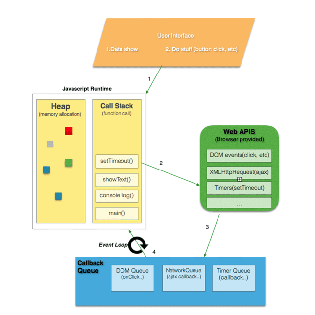

:source-highlighter: highlight.js
:highlightjs-theme: atom-one-dark-reasonable

= *Group2 JavaScript研究*

== *文法*

=== *具名函式/匿名函式*:

[width=75%, cols="1,2,2"]
|===
|特性|具名函式|匿名函式
|名稱|有名稱|沒有名稱
|提升|是，提升到當前作用域的頂部|否，不能在定義前使用
|遞歸|是，可以自我調用|否，無法自我調用
|使用場景|多次調用、遞歸、調試|一次性使用、回調、事件處理
|===

== 具名函式
* 可使用聲明函式提升作用域
** 因此在定義前被調用不會出現錯誤

[,javascript]
----
console.log(sayHello("Alice")); // 調用函式

function sayHello(name) {
  return "Hello, " + name + "!";
}

}
----

[,javascript]
----
function sayHello(name) {
  return "Hello, " + name + "!";
}

console.log(sayHello("Alice")); // 調用函式

----

* 也可以用一般的表達式

[,javascript]
----
const subtract = function subtractNumbers(a, b) {
  return a - b;
};

console.log(subtract(5, 2)); // 輸出：3

----
* 可自我調用(遞迴)

[,javascript]
----
function factorial(n) {
  if (n === 0) {
    return 1; // 當 n 是 0 時，直接返回 1
  } else {
    return n * factorial(n - 1); // 調用自己，但 n 減 1
  }
}

console.log(factorial(5)); // 這裡會輸出 120，也就是 5 * 4 * 3 * 2 * 1
----

== *匿名函式*

* 匿名函式是指沒有名字的函式，它通常用於特定的用途而不需要重複使用。

*一般表達式 

[,javascript]
----
// 定義匿名函式並賦值給變量 add
const add = function(a, b) {
  return a + b;
};

// 使用 add 變量調用匿名函式
console.log(add(2, 3)); // 輸出：5

----

*回調函數(用來告訴程序在某個操作完成後做什麼事情)

[,javascript]
----
// 使用 setTimeout 函式進行延遲操作
setTimeout(function() {
  console.log("1 秒後顯示");
}, 1000);

----

*即刻執行函數

[,javascript]
----
(function() {
  var privateVar = "這是私有變量";
  console.log(privateVar); // 輸出：這是私有變量
})();

// 外部無法訪問 privateVar
console.log(privateVar); // 錯誤：privateVar is not defined

----

== Automatic Semicolon Insertion, ASI:

=== 先了解JavaScript語法
 * 程式碼區塊

[,javascript]
----
const a = ["String1","String2"] //字串 
const b = a ${a[1]} a //字串

const c = ["a","b"] //陣列

const e = ()=>{} //function
const f = function (){} // function
function g (){} //function

const d = {a,b,g}; //json 物件

//存取json
d.a
d["b"]
d.g() //執行fucntion
d["g"]()//執行fucntion
----

== Automatic Semicolon Insertion, ASI 中譯"自動插入分號"
* 程式碼區塊未結束 不會ASI

[,Javascript]
----
const a = [ //不會ASI
  "String1",//不會ASI
  "String2" //不會ASI
]  //ASI

const b = `a ${a} //不會ASI
 a` //ASI
----

* 下一行為運算子開頭 不會ASI

[,Javascript]
----
var a = 1 //不會ASI
+1 //ASI
++ //不會ASI
a //ASI
----

* [yellow]#下行開頭為 [ 、 (#

[source,Javascript]
----
console.log('log')

(function(){
  console.log('IIFE')
}())
----

[source,Javascript]
----
console.log('log');

['array'].map(function(element){
  console.log(element)
})
----

== *非同步*

=== *同步/非同步差異*:

* Javascript 是一種「單執行緒 (Single-Thread)」的語言，意思就是一次只能做一件事情，如果安排了很多事情要給他做，他就會讓這些事情去排隊，再一件一件做，逐行執行。這就是所謂的同步，一次只做一件事情。非同步的概念則是不需要等到前一件事情做完才做下一件事情。
* 程式碼:同步的程式碼就是一行一行執行下去非常直觀，而非同步就跟同步相反， 非同步的程式碼不用等待自己執行完畢就可以先執行下一行程式碼。
* 情境劇:
** 中午到了，小明要準備出門買雞腿便當配珍奶，假如今天小明走的是同步路線的話會長這樣：
*** 小明到了便當店點了雞腿便當，等到雞腿便當拿到之後再到飲料店點珍奶。
** 如果是非同步路線會長這樣：
*** 小明到了便當店點了雞腿便當，在等待的過程中先到飲料店點珍奶，之後再看哪邊先做完就先去拿已經做完的餐點。

* Stack(堆疊)
*** Stack 中文翻譯為堆疊，是資料結構的一種，它就像是疊盤子一樣，特性為後進先出

* Queue(佇列)
*** Queue 中文翻譯為佇列，是資料結構的一種，它就像排隊一樣，特性為先進先出

* Web APIs
*** Web API 是瀏覽器提供的方法，它並不是 JavaScript運行環境的一部分，且運作於瀏覽器端，也就是說他們可以同時運行

* Event Loop
*** 一個達成一個不阻塞的機制，主要功能是，一旦Stack清空，Event Loop就會把Queue中的第一個項目放到Stack中，Stack就會執行該項目。

* 圖示

* 在javascript 中的同步與非同步範例:

[,Javascript]
----
//同步
console.log('a');

function tf(){
    console.log('b');
}

tf();

console.log('c');
----

[,Javascript]
----
//非同步
console.log('a');

setTimeout(function t1(){
    console.log('b');
},10000);
setTimeout(function t2(){
    console.log('d');
},10000;

console.log('c');
----

Demo
[#link]
* http://latentflip.com/loupe/?code=Y29uc29sZS5sb2coJ2EnKTsKCgpzZXRUaW1lb3V0KGZ1bmN0aW9uIHRmKCl7CiAgICBjb25zb2xlLmxvZygnYicpOwp9LDEwMDAwKTsKCmNvbnNvbGUubG9nKCdjJyk7

=== *XMLHttpRequest/fetch*
  - XMLHttpRequest(XHR)
    * 更為古老
    * 使用上較為困難(底層)
    * 使用Callback
    * 範例 

[,Javascript]
----
function reqListener () {
  console.log(this.responseText);
}
var oReq = new XMLHttpRequest();
oReq.addEventListener("load", reqListener);
oReq.open("GET", "http://www.example.org/example.txt");
oReq.send(); 
----

  - fetch
    * 版本較新
    * 更多方便的API
    * 回傳Promise
    * 範例

[,Javascript]
----
fetch("http://www.example.org/example.txt")
 .then(res=>res.text())
 .then(console.log)
----

=== *AJAX*
  - 方法重點-以非同步的方式進行網路請求，再以DOM更新至HTML。

=== *Promise*:

Promise 本身是用來改善 JavaScript 非同步的語法結構。
JavaScript 是屬於同步的程式語言，因此一次僅能做一件事情，但遇到非同步的事件時，就會將非同步的事件移動到程式碼的最後方，等到所有的原始碼運行完以後才會執行非同步的事件。

以下列的程式碼來說，在 console 中依序的會出現的順序為：

- 開始

- 程式碼結束

- 非同步事件 <- 最後執行

[,javascript]
----
console.log('開始');

setTimeout(() => {
  console.log('非同步事件');
}, 0);

console.log('程式碼結束');
----

[big]*建立Promise*

Promise 是一個構造函式，需要透過 new 關鍵字建立一個Promise。而 Promise 會接收一個函式作為參數，這個函式又稱為 executor，executor 會立即執行。

[,Javascript]
----
new Promise((resolve, reject) => {
  console.log("executor 立即執行"); // executor 立即執行
});
----

[,Javascript]
----
function requestData(url) {
  return new Promise((resolve, reject) => {
    setTimeout(() => {
      if (url === "explainthis.io") {
        resolve("hello welcome to explainthis");
      } else {
        reject("it is not explainthis");
      }
    }, 3000);
  });
}

// 1. 請求成功
requestData("explainthis.io").then((res) => {
  console.log(res); //hello welcome to explainthis
});

//2. 請求失敗
requestData("explainthis.com").catch((e) => console.log(e)); //it is not explainthis
----

[big]*狀態*

一個 Promise 一定會處於以下三種狀態的其中一種

- pending：初始狀態，執行了 executor，但還在等待中。
- fulfilled：表示操作完成，執行 resolve 函式。
- rejected：表示操作失敗，執行 reject 函式。

[big]*then 的使用*

[,Javascript]
----
function requestData(url) {
  return new Promise((resolve, reject) => {
    setTimeout(() => {
      if (url === "explainthis.io") {
        resolve("hello welcome to explainthis");
      } else {
        reject("it is not explainthis");
      }
    }, 0);
  });
}

requestData("explainthis.com").then(
  (res) => {
    console.log(res);
  },
  (reason) => {
    console.log(reason);
  }
);
----

[big]*錯誤處理*

- catch

[,Javascript]
----
fetch("https://explainthis.com/data")
  .then((response) => response.json())
  .then((data) => {
    console.log(data);
  })
  .catch((error) => {
    console.error(error);
  })
  .finally(() => {
    console.log("close loader");
  });
----

=== *async/await*:

在 JavaScript 中，async/await 是一種讓非同步操作更容易理解和管理的語法。它建立在 Promise 的基礎上，但提供了更簡潔、更直觀的方式來處理非同步操作。

=== *async語法*

使用 async 關鍵字聲明的函式為非同步函式，非同步函式會返回一個 Promise 物件，而非直接返回函式執行的結果。
下方普通函式 f1() 直接返回字串 "Hello! ExplainThis!"

[,Javascript]
----
// 普通函式
function f1() {
  return "Hello! ExplainThis!";
}

f1(); // 輸出: "Hello! ExplainThis!"
----

下方程式碼中， async function f2() {...} 定義了一個名為 f2 的非同步函式，該函式返回字串 "Hello! ExplainThis!"，並將其封裝在一個 Promise 物件中。

[,Javascript]
----
// 非同步函式
async function f2() {
  return "Hello! ExplainThis!";
}

f2(); // 輸出: Promise {<fulfilled>: 'Hello! ExplainThis!'}
----

這兩個程式碼寫法其實是相同的，因為使用 async 時，會自動將回傳值包裝在一個 Promise 物件當中。

由於 async 函式總是返回一個 Promise 物件，如果要獲取該 Promise 的解析值，可以使用 .then() 方法:

[,Javascript]
----
async function f2() {
  return "Hello! ExplainThis!";
}

f2().then((result) => {
  console.log(result); // "Hello! ExplainThis!"
});
----

=== *await語法*

await 是一個運算子，用於等待一個 Promise 完成或拒絕。它通常與 async 函式一起使用，因為只有在 async 函式內部或模組的頂層，才能使用 await。

當使用 await 時，程式會暫停執行該 async 函式，直到 await 等待的 Promise 完成並回傳結果後，才會繼續往下執行。

[,Javascript]
----
async function getData() {
  // await 等待 fetch 這個非同步函式返回一個 Promise 並解析它
  const res = await fetch("https://example.com/data");

  // await 等待上一步的 Promise 解析後，再解析它的 JSON 資料
  const data = await res.json();

  // 前面兩步都完成後，才會執行這一行並印出資料
  console.log(data);
}

getData();
----

=== *使用 await 要注意的幾點*

在非 async 函式中使用 await 會報 SyntaxError 的錯誤

[,Javascript]
----
function f() {
  let promise = Promise.resolve("Hello! ExplainThis!");
  let result = await promise;
}
----

=== *如何使用 async/await*

使用 async/await 可以將非同步程式碼寫成類似同步的形式，使其更易讀、且更易維護。以下是一個用 Promise 寫的 getData 函式:

[,Javascript]
----
function getData(url) {
  return new Promise((resolve， reject) => {
    fetch(url)
      .then((res) => res.json())
      .then((data) => resolve(data))
      .catch((error) => reject(error));
  });
}

getData("https://example.com/data")
  .then((data) => console.log(data))
  .catch((error) => console.error(error));
----

=== *使用 async/await 來重寫 getData 函式*

[,Javascript]
----
async function getData(url) {
  try {
    const res = await fetch(url);
    const data = await res.json();
    console.log(data);
  } catch (error) {
    console.error(error);
  }
}

getData("https://example.com/data");
----

=== *async/await 與 Promise 的差別*

async/await 和 Promise 都是用於處理非同步操作的方式，但它們有以下一些差異:

- 語法: async/await 提供了更簡潔、更直觀的語法，使得非同步程式碼更易讀和維護。Promise 則需要使用 then 和 catch 方法來處理結果和錯誤，語法上較為冗長。
- 錯誤處理: 在 async/await 中，可以直接使用 try...catch 來捕獲錯誤，而在 Promise 中需要使用 catch 方法。
- 程式碼流程: async/await 可以使非同步程式碼看起來更像同步程式碼，更容易閱讀和理解。Promise 的程式碼流程則較為不連貫。

* * *